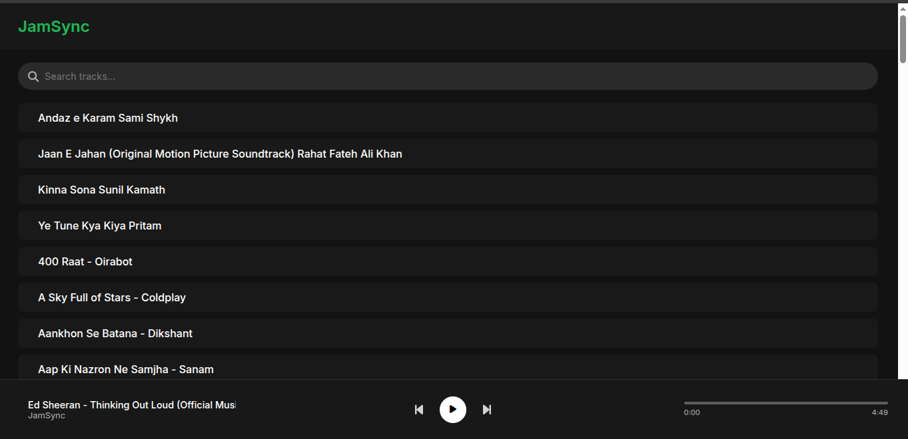
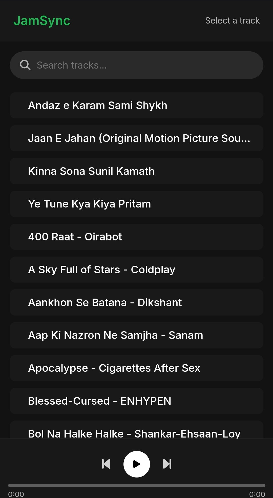

# 🎧 JamSync – Web Advanced

> **Built with ❤️ by Haider, for Samiya – so we can vibe together, no matter the distance.**

---

## 🌟 About the Project

**JamSync** is a **real-time collaborative music streaming web application**, handcrafted for a special purpose:  
To let me and my girlfriend, **Samiya**, listen to music together — perfectly in sync — even when we're apart.

This isn't just a web app.  
It's our **digital music room** — a place where:
- Every beat is a shared heartbeat,
- Every pause is a smile,
- And every song becomes **our memory**.

---

## 💡 Features

JamSync isn't just another web music player — it's a **shared experience** designed for two hearts, one vibe.  
Here’s what it offers:

### 🎶 Real-Time Synchronized Playback  
Listen to your favorite tracks in perfect sync, no matter where you are — thanks to `Socket.io`-powered real-time events.

### 📂 Custom Music Library  
Upload your own `.mp3` files to the `public/music/` folder and build a personalized playlist of songs that matter most to you both.

### 🎧 Simple & Elegant Interface  
A clean, minimal layout ensures the focus stays on what truly matters — the music and the moment.

### 🖤 Romantic Personalization *(in progress)*  
Custom header with names (e.g., “JamSync – Haider ❤️ Samiya”), soft color themes, and thoughtful details designed to reflect your love story.

### 💬 Live Chat *(coming soon)*  
Share words, lyrics, or love notes in real-time while listening — because sometimes, a song says it all, and sometimes you want to add a little more.

### 🔁 Sync Events  
Play, pause, or seek — every action is mirrored across both users so you stay in rhythm together.

### 🔐 Private and Personal  
Meant for **just the two of us** — there are no signups, no distractions, just your own music and shared time.

---

## 🎁 Special Dedication

This project is lovingly dedicated to **Samiya Binte Salam** –  
the one whose presence turns every ordinary song into something unforgettable.  

From our first jam to every future playlist we’ll share,  
**JamSync** is more than just code — it’s our private space,  
crafted to keep us close even when miles apart.

> *“For every note we share, I want us to be together — even when we’re far apart.”*

With every beat, we write our story.  
With every pause, we feel each other’s silence.  
This isn’t just an app — it’s a piece of us.

---

## 📸 Preview

| Desktop View | Mobile View |
|--------------|-------------|
|  |  |

> *Designed to keep our hearts in sync — whether on a big screen or in the palm of our hands.* 💑🎶

---

## 🛠️ Tech Stack

- **Frontend**: HTML, CSS, JavaScript  
- **Backend**: Node.js, Express.js  
- **Realtime Communication**: Socket.io  

