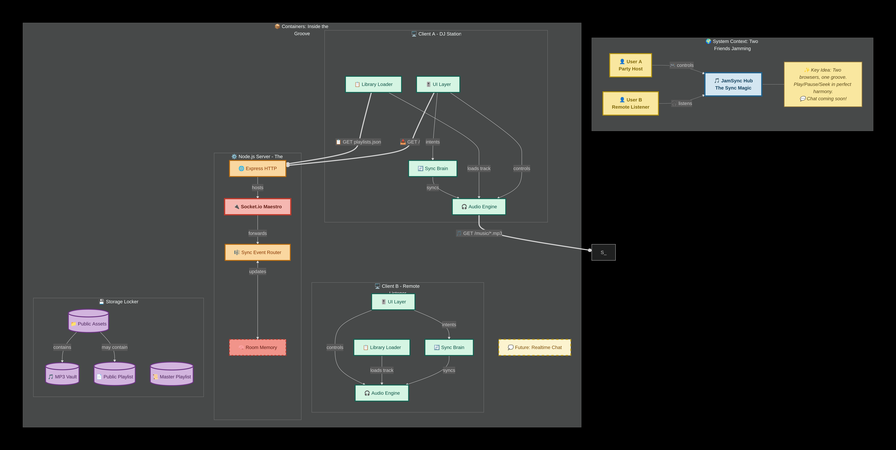
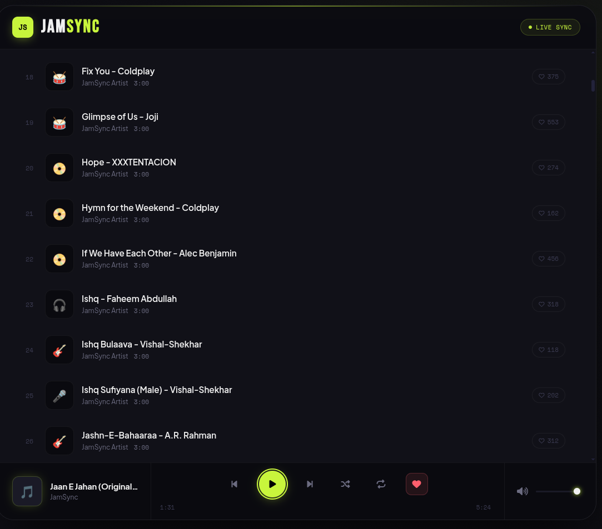
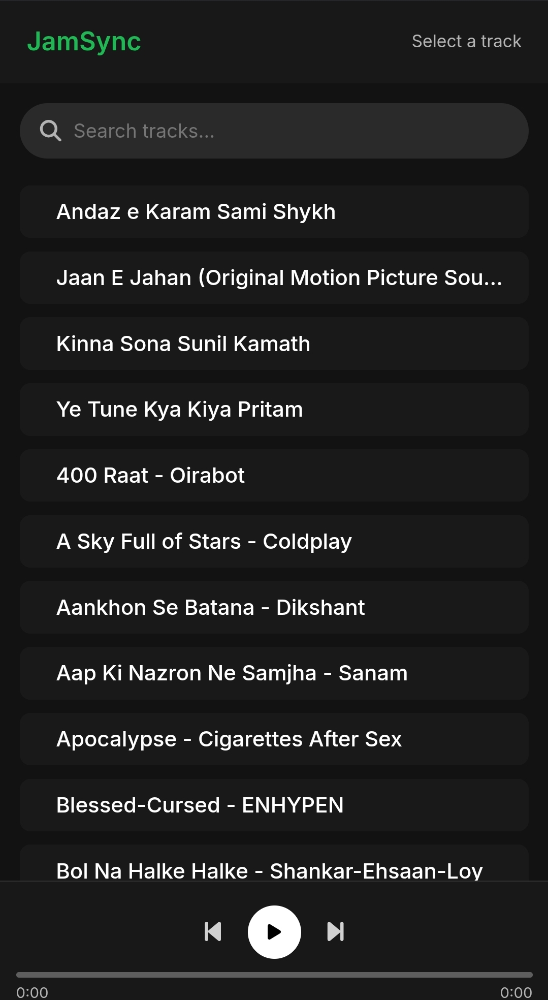
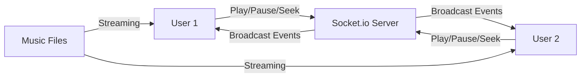

# 🎵 JamSync – Together in Every Beat



<div align="center">
  
  **A real-time collaborative music streaming experience, crafted with love for two hearts, one vibe.**
  
  [](https://nodejs.org/)
  [](https://expressjs.com/)
  [](https://socket.io/)
  [](https://developer.mozilla.org/en-US/docs/Web/JavaScript)
  
  <br>
  
  [🌟 About](#-about-the-project) • 
  [✨ Features](#-features) • 
  [🎯 Purpose](#-special-purpose) • 
  [📸 Preview](#-preview) • 
  [🛠️ Tech](#-tech-stack) • 
  [🚀 Setup](#-getting-started)
  
</div>

---

## 🌟 About the Project

**JamSync** is more than just a web application — it's a **bridge across distances**, a **shared musical journey** designed to bring two people together through the universal language of music.

In a world where physical distance can keep loved ones apart, JamSync creates a virtual space where music becomes the thread that connects hearts. Whether you're in the same room or thousands of miles apart, every note, every beat, every moment of silence is shared in perfect harmony.

> *"Distance means so little when someone means so much."*

---

## ✨ Features

<div align="center">
  <table>
    <tr>
      <td align="center">
        <br />
        <b>Real-Time Sync</b>
      </td>
      <td align="center">
        <br />
        <b>Personal Library</b>
      </td>
      <td align="center">
        <br />
        <b>Live Chat</b>
      </td>
    </tr>
  </table>
</div>

### 🎶 **Perfect Synchronization**
Powered by `Socket.io`, every play, pause, and seek is mirrored instantly between connected users. No delays, no mismatches — just pure, shared moments in music.

### 📂 **Your Music, Your Story**
Upload your personal `.mp3` collection to the `public/music/` folder. Every song you've shared, every track that holds a memory — they all find a home here.

### 🎧 **Elegant & Intuitive Interface**
A minimalist design that puts the music first. Clean lines, soft shadows, and a soothing gradient background create the perfect ambiance for your listening sessions.

### 💬 **Live Chat *(Coming Soon)***
Share thoughts, lyrics, or just a simple "I miss you" while the music plays. Because sometimes the words between songs matter just as much.

### 🔁 **Mirrored Control**
Everything you do, they see. Start a song, pause to laugh at a memory, skip to that one special track — every action is a shared experience.

### 🔐 **Intimate & Private**
No sign-ups, no data collection, no distractions. Just a private space for two people to connect through their favorite melodies.

---

## 🎁 Special Purpose

<div align="center">
  
</div>

JamSync is lovingly crafted for **Samia Binte Salam** —  
the melody to my silence, the harmony to my rhythm.

This isn't just code on a server. It's:

- 🌙 **Late nights** when music fills the silence between us
- ☀️ **Morning vibes** that start with our favorite tracks
- 📍 **Every distance** that music helps us bridge
- 💕 **Every memory** that has a soundtrack
- 🎵 **Every future song** we'll discover together

> *"For every note we share, I want us to be together — even when we're far apart."*

Every line of code, every pixel on the screen, every feature implemented — they all carry a piece of a story that continues to write itself with every song we play together.

---

## 📸 Preview

<div align="center">
  <table>
    <tr>
      <td align="center">
        <strong>🖥️ Desktop Experience</strong>
      </td>
      <td align="center">
        <strong>📱 Mobile Moments</strong>
      </td>
    </tr>
    <tr>
      <td>
        
      </td>
      <td>
        
      </td>
    </tr>
  </table>
  
  <br>
  
  
  
  <p><em>Designed to keep our hearts in sync — whether on a big screen or in the palm of our hands.</em></p>
</div>

---

## 🛠️ Tech Stack

<div align="center">
  
  ```
  Frontend     →  HTML5, CSS3, JavaScript (ES6+)
  Backend      →  Node.js, Express.js
  Realtime     →  Socket.io
  Styling      →  Custom CSS with Gradients & Flexbox
  Icons        →  Font Awesome 6
  ```
  
  <br>
  
  
  
</div>

### Architecture Highlights

- **Event-Driven Architecture**: Real-time communication through WebSockets
- **RESTful API**: Simple and efficient backend routes
- **Responsive Design**: Mobile-first approach with fluid layouts
- **Zero Latency**: Optimized for instant playback synchronization

---

## 🚀 Getting Started

### Prerequisites

- [Node.js](https://nodejs.org/) (v12 or higher)
- npm (comes with Node.js)
- Your favorite MP3 files 💝

### Installation

1. **Clone the repository**
   ```bash
   git clone https://github.com/yourusername/jamsync.git
   cd jamsync
   ```

2. **Install dependencies**
   ```bash
   npm install
   ```

3. **Add your music**
   - Place your `.mp3` files in the `public/music/` folder
   - Update the playlist in `public/js/player.js`

4. **Start the server**
   ```bash
   npm start
   ```
   or for development with auto-reload:
   ```bash
   npm run dev
   ```

5. **Open the magic**
   - Navigate to `http://localhost:3000`
   - Share the URL with your special someone
   - Press play and feel the connection

---

## 🎮 How It Works


```mermaid
graph LR
    A[User 1] -->|Play/Pause/Seek| B[Socket.io Server]
    C[User 2] -->|Play/Pause/Seek| B
    B -->|Broadcast Events| A
    B -->|Broadcast Events| C
    D[Music Files] -->|Streaming| A
    D -->|Streaming| C
```

1. **Connect** – Both users open the application
2. **Sync** – Socket.io establishes a real-time connection
3. **Play** – Any playback action is instantly mirrored
4. **Share** – Every moment becomes a shared experience

---

## 🤝 Contributing

While JamSync is a personal project, the spirit of open source lives here. If you'd like to adapt this for your own special someone:

1. Fork the repository
2. Create your feature branch (`git checkout -b feature/YourFeature`)
3. Commit your changes (`git commit -m 'Add some magic'`)
4. Push to the branch (`git push origin feature/YourFeature`)
5. Open a Pull Request

---

## 📝 License

This project is licensed with **love** – feel free to use, modify, and share, but always remember that the best code is written with heart.

---

## 💌 Final Note

<div align="center">
  
  
  **To Samia, with all my heart**
  
  Every time you press play,<br>
  know that I'm right there with you —<br>
  in the music, in the silence, in everything.
  
  *Distance is just a test of how far we have loved .*
  
  <br>
  
  **With love,**
  
  **— Will be forever there dear** 🎵
  
  <br>
  
  [](https://github.com/yourusername/jamsync)
  
</div>

---

<div align="center">
  <sub>Building with lost emotions and JavaScript | © 2024 JamSync</sub>
</div>
